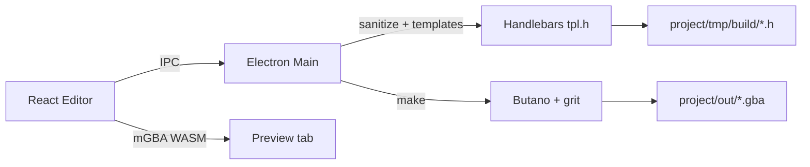
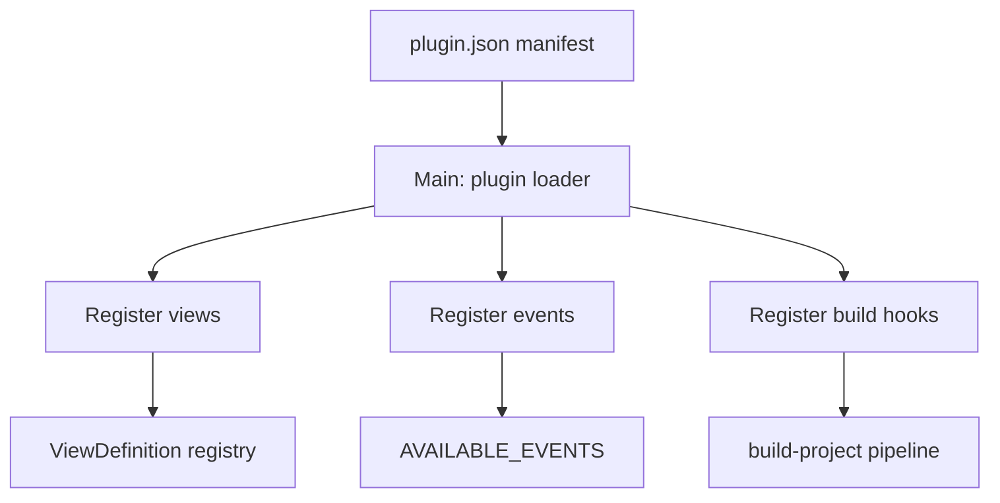
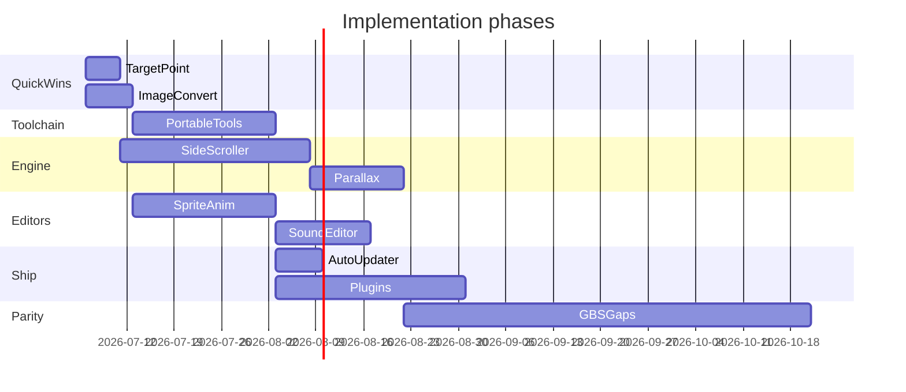

# GBA Studio Fork — v1.0 Roadmap & GB Studio Parity Plan

## Current State

GBA Studio is an Electron + React editor that generates Butano C++ from Handlebars templates, then runs `make` with external Python and devkitARM. The runtime supports two scene modes inferred from JSON (`logos` = no player, `2d-top-down` = grid player + collisions).

**Already done (creator):** file watching, copy/paste events, variable values everywhere, event rename, foreground sprites, WASM mGBA preview.

**Architecture touchpoints:**



| Layer | Key paths |
|-------|-----------|
| Types & events | [`src/types.ts`](src/types.ts), [`src/renderer/services/events.tsx`](src/renderer/services/events.tsx) |
| Scene canvas | [`src/renderer/views/canvas/`](src/renderer/views/canvas/) |
| Build pipeline | [`src/main/handles/build-project/index.ts`](src/main/handles/build-project/index.ts) |
| Codegen | [`public/templates/commons/templates/`](public/templates/commons/templates/) |
| Runtime | [`public/templates/commons/src/`](public/templates/commons/src/) |

---

## Phase 1 — Quick UX Wins (1–2 weeks)

### 1.1 Move target point from the target scene

**Problem:** [`EventGoToScene.tsx`](src/renderer/components/EventsField/EventGoToScene.tsx) only accepts manual X/Y entry. [`EventMoveCameraTo.tsx`](src/renderer/components/EventsField/EventMoveCameraTo.tsx) already shows the pattern: emit `scene:camera:set` / `reset` via `eventEmitter` to overlay a marker on the canvas.

**Implementation:**
- Extend `EventGoToScene` to emit `scene:goto:set` with `{ sceneId: event.target, x, y, direction }` on focus and when coords change.
- In [`Scene.tsx`](src/renderer/views/canvas/Scene.tsx), listen for that event and render a draggable spawn marker on the **target** scene (not the source).
- Click/drag on target scene updates `event.start.x/y`; direction picker stays in the event panel.
- Reuse tile/pixel conversion from [`helpers.ts`](src/helpers.ts) and arrow resolution in [`Arrow.tsx`](src/renderer/views/canvas/Arrow.tsx).

**No runtime changes** — `go-to-scene.start` and `last_goto_event` in [`game.cpp`](public/templates/commons/src/game.cpp) already work.

### 1.2 Images auto-convert on build

**Problem:** Users must manually supply Butano-compatible `.bmp` + `.json` pairs. `jimp` is in [`package.json`](package.json) but unused.

**Implementation:**
- Add pre-build step in [`build-project/index.ts`](src/main/handles/build-project/index.ts) before template generation:
  - Scan `project/graphics/` for `.png`, `.jpg`, `.gif` without a matching `.bmp`.
  - Convert to indexed BMP (respect GBA palette limits: 16/256 colors depending on asset type).
  - Generate or update companion `.json` from [`sprite_default.json`](public/templates/commons/graphics/sprite_default.json) / [`bg_default.json`](public/templates/commons/graphics/bg_default.json) templates (infer `width`/`height` from image).
- Add optional project setting: `autoConvertImages: boolean` (default on).
- Surface conversion log lines in the existing build log UI.

---

## Phase 2 — Toolchain Portability (2–4 weeks, all platforms)

**Problem:** README requires manual Python 3+ and devkitARM. Only `pythonPath` is configurable in [`ProjectSettings`](src/types.ts); devkitARM must be on `PATH` via `DEVKITARM`.

**Implementation strategy:**

1. **Bundled Python (embeddable)**
   - Ship platform-specific embedded Python in `extraResource` (similar to how Butano is bundled under [`public/vendors/butano`](public/vendors/butano)).
   - Default `pythonPath` to bundled binary; fall back to system Python if user overrides in Settings.
   - CI script downloads/embeds Python per platform (win32, darwin arm64/x64, linux x64/arm64).

2. **Bundled devkitARM**
   - Download devkitPro devkitARM release artifacts per platform into `public/vendors/devkitarm/`.
   - Generate `project/tmp/.env` at build time with `DEVKITARM=<bundled path>` and prepend bundled `bin/` to `PATH` in [`utils.ts`](src/main/handles/build-project/utils.ts) `runCommand()`.
   - Add Settings UI: "Use bundled toolchain" toggle + optional custom `DEVKITARM` path.

3. **First-run setup**
   - On app launch, verify bundled tools exist; if missing (e.g. dev install without vendors), show setup wizard with download progress.
   - Update [`ConfigurationForm.tsx`](src/renderer/views/settings/ConfigurationForm.tsx) and pre-build checks in `checkPython()`.

4. **Packaging**
   - Extend [`.plugins/remove-vendors.ts`](.plugins/remove-vendors.ts) to trim only unused platform slices, not the active platform's toolchain.
   - Update [`forge.config.ts`](forge.config.ts) and GitHub Actions workflow for multi-platform vendor downloads.

**Note:** devkitARM redistribution must comply with devkitPro license terms; document this in the fork README.

---

## Phase 3 — Side Scroller Scene Type (3–5 weeks)

**Problem:** Only `'logos' | '2d-top-down'` in [`GameScene.sceneType`](src/types.ts). No platform physics, gravity, or horizontal camera scroll.

**Data model changes:**
- Add `sceneType: 'side-scroller'` to types, schema ([`.schemas/scene.json`](public/templates/commons/.schemas/scene.json)), and [`SceneForm.tsx`](src/renderer/views/canvas/SceneForm.tsx).
- Extend `GamePlayer` / scene settings: gravity, jump strength, max fall speed, run speed, coyote time (optional).
- Collision model: tile types — solid, platform (pass-through from below), ladder (future).
- Compile `sceneType` into generated C++ (today it's inferred only from player presence — see [`neo_scenes.tpl.h`](public/templates/commons/templates/neo_scenes.tpl.h)).

**Editor:**
- Side-scroller collision paint mode (distinct from top-down grid collisions in [`Scene.tsx`](src/renderer/views/canvas/Scene.tsx)).
- Camera bounds preview (wider than 240×160 viewport).

**Runtime (new/modified C++):**
- New `side_scroller_player.cpp` or branch in [`player.cpp`](public/templates/commons/src/player.cpp): pixel-based movement, gravity, jump, platform collision.
- Camera: horizontal follow with vertical clamp; map wider than screen.
- Reuse sensors/actors/events — same event system.

**Reference:** GB Studio's Platform scene type — side-scroller is the highest-impact parity gap after the roadmap items.

---

## Phase 4 — Parallax Backgrounds (2–3 weeks)

**Depends on:** Phase 3 camera work (shared scroll math), but can start in parallel for top-down scenes.

**Data model:**
- Extend `GameScene` with `backgroundLayers?: BackgroundLayer[]`:

```typescript
interface BackgroundLayer {
  background: string;
  scrollX: number;  // 0 = fixed, 1 = moves with camera, 0.5 = half speed
  scrollY: number;
  priority: number;
}
```

**Editor:**
- Layer list in [`SceneForm.tsx`](src/renderer/views/canvas/SceneForm.tsx) with add/remove/reorder.
- Canvas preview: composite layers with parallax offset based on camera position.

**Runtime:**
- Replace single `bn::regular_bg_ptr` in [`game.cpp`](public/templates/commons/src/game.cpp) with an array of BG layers.
- Update scroll each frame in camera/player update using Butano `regular_bg_ptr::set_x/y`.

**Build:** Codegen in [`neo_scenes.tpl.h`](public/templates/commons/templates/neo_scenes.tpl.h) emits layer init + scroll factors.

---

## Phase 5 — Sprite Animations Editor (3–4 weeks)

**Problem:** Animations are hardcoded in [`sprites.ts`](src/renderer/services/sprites.ts) (editor preview) and [`commons.h`](public/templates/commons/include/commons.h) (runtime). [`GameSpriteFile`](src/types.ts) has only `width`/`height`.

**Data model:**
- Extend `GameSpriteFile` JSON schema:

```json
{
  "type": "sprite",
  "width": 16,
  "height": 16,
  "animations": {
    "idle": { "down": 0, "up": 1, "left": 2, "right": 2 },
    "walk": { "down": [4, 5], "up": [6, 7], "left": [8, 9], "right": [8, 9] }
  }
}
```

**Editor (new view or sidebar panel):**
- Register a fourth view in [`views/index.tsx`](src/renderer/views/index.tsx): "Sprites" with spritesheet preview, frame grid, animation timeline.
- Click frames to assign to animation states; play preview with canvas [`Sprite/index.tsx`](src/renderer/components/Sprite/index.tsx).

**Runtime:**
- Codegen: emit per-sprite animation tables in generated headers instead of global `commons.h` constants.
- Update [`player.cpp`](public/templates/commons/src/player.cpp) and [`actor.cpp`](public/templates/commons/src/actor.cpp) to reference sprite-specific animation data.

---

## Phase 6 — Sound Editor (2–4 weeks, scoped MVP)

**Problem:** Audio is file-drop only ([`getSoundFiles`](src/main/files.ts)); events reference files via [`EventPlayMusic.tsx`](src/renderer/components/EventsField/EventPlayMusic.tsx) / [`EventPlaySound.tsx`](src/renderer/components/EventsField/EventPlaySound.tsx).

**MVP scope (avoid building a full tracker):**
- New "Audio" view: list music (`.mod`, `.xm`, etc.) and SFX (`.wav`).
- Import/rename/delete assets; waveform preview + basic trim for WAV.
- Volume normalize option on import.
- Optional: simple SFX generator (beep presets) — defer full music composition.

**Runtime:** No changes if output formats stay the same (Butano handles `.wav` / tracker formats).

---

## Phase 7 — Auto Updater (1 week)

**Problem:** No `electron-updater`; users download CI artifacts manually. [`electron-squirrel-startup`](src/main/index.ts) only handles install bootstrap.

**Implementation:**
- Add `electron-updater` dependency.
- Configure GitHub Releases as update feed in [`forge.config.ts`](forge.config.ts) (add `publishers` config).
- Main process: check on startup + "Check for Updates" menu item in [`menus.ts`](src/main/menus.ts).
- Renderer: non-blocking update notification dialog (download → restart).
- Windows: Squirrel feed; macOS: ZIP + `electron-updater`; Linux: AppImage/ZIP with manual prompt (standard limitation).

---

## Phase 8 — Plugin System (4–6 weeks)

**Problem:** "Plugins" in repo = Vite/Forge build hooks only ([`.plugins/`](.plugins/)). No user extension API.

**Architecture:**



**Plugin manifest (`plugin.json`):**
- `name`, `version`, `main` (entry script)
- `contributes.views`, `contributes.events`, `contributes.buildSteps`

**Implementation:**
- Dynamic import of plugins from `{userData}/plugins/` and `{project}/plugins/`.
- Extend hardcoded [`views/index.tsx`](src/renderer/views/index.tsx) and [`events.tsx`](src/renderer/services/events.tsx) registries to merge plugin contributions at startup.
- IPC bridge for plugins (sandboxed: no raw Node in renderer — run plugin code in main or isolated context).
- Ship one reference plugin (e.g. "Hello World" custom event) as documentation.

**Design plugins early** — sprite animation and sound editors could later be migrated to first-party plugins, validating the API.

---

## Phase 9 — GB Studio Parity Gaps (ongoing, prioritized)

Features GB Studio has that GBA Studio lacks, ordered by impact:

| Feature | Effort | Notes |
|---------|--------|-------|
| **Actor movement events** (move to, face direction) | Medium | New events + C++ in `actor.cpp`; editor fields in [`ActorForm.tsx`](src/renderer/views/canvas/ActorForm.tsx) |
| **Variable math** (add/sub/mul/div/mod, random) | Low | Extend [`set-variable`](src/types.ts) or add `change-variable` event; codegen in [`events.tpl.h`](public/templates/commons/templates/partials/events.tpl.h) |
| **Camera shake** | Low | New event + short Butano camera action in [`camera.cpp`](public/templates/commons/src/camera.cpp) |
| **Point-and-click scene type** | High | Cursor-based movement, hotspot entities, no grid — new scene type like Phase 3 |
| **Custom fonts / dialog themes** | Medium | Extend [`show-dialog`](src/renderer/components/EventsField/EventShowDialog.tsx) + Butano text rendering |
| **Save/load game** | High | Variable persistence to SRAM/Flash; new save events |
| **Actor emotes** | Low | Bubble sprite above actor; timed display event |
| **Scene transition effects** | Medium | Slide/wipe beyond fade-in/out |
| **Asset manager view** | Medium | Unified backgrounds/sprites browser with import — overlaps Phase 5/6 |
| **Engine fields** (project constants) | Low | Similar to variables but compile-time |

Tackle **variable math** and **camera shake** early (low effort, high parity value). **Point-and-click** and **save/load** are large and should follow side-scroller + parallax.

---

## Recommended Implementation Order



**Suggested first sprint:** Phase 1 (target point + image convert) — immediate user value, no engine risk.

**Parallel tracks after Phase 1:**
- Track A: Phase 2 (toolchain) + Phase 7 (updater) — distribution
- Track B: Phase 3 → 4 (engine) — gameplay
- Track C: Phase 5 → 6 (editors) — content creation

---

## Testing Strategy

- **Unit:** Image conversion, template codegen snapshots, plugin manifest parsing.
- **Integration:** Build sample project end-to-end with bundled toolchain on win/mac/linux CI.
- **Manual:** Each new scene type gets a sample project in [`public/templates/`](public/templates/).
- **Regression:** Existing `2d-sample` template must build and run in mGBA preview unchanged.

---

## Out of Scope

- Windows **signed** installer (explicitly skipped).
- Full music tracker / DAW — sound editor MVP only.
- 100% GB Studio feature parity in v1 — Phase 9 is ongoing.
