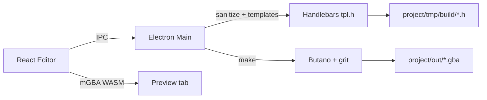
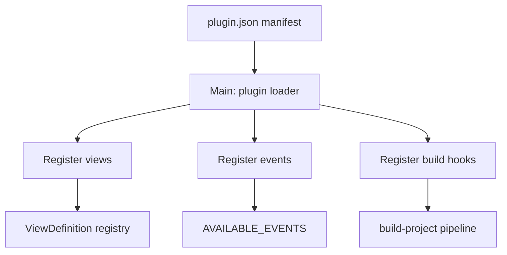
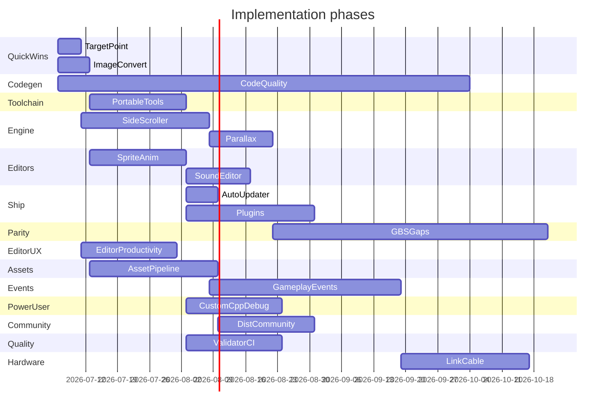

# GBA Studio Fork — v1.0 Roadmap & GB Studio Parity Plan

## Current State

GBA Studio is an Electron + React editor that generates Butano C++ from Handlebars templates, then runs `make` with external Python and devkitARM. The runtime supports two scene modes inferred from JSON (`logos` = no player, `2d-top-down` = grid player + collisions).

**Already done (creator):** file watching, copy/paste events, variable values everywhere, event rename, foreground sprites, WASM mGBA preview.

**Architecture touchpoints:**



| Layer | Key paths |
|-------|-----------|
| Types & events | [`src/types.ts`](src/types.ts), [`src/renderer/services/events.tsx`](src/renderer/services/events.tsx) |
| Scene canvas | [`src/renderer/views/canvas/`](src/renderer/views/canvas/) |
| Build pipeline | [`src/main/handles/build-project/index.ts`](src/main/handles/build-project/index.ts) |
| Codegen | [`public/templates/commons/templates/`](public/templates/commons/templates/) |
| Runtime | [`public/templates/commons/src/`](public/templates/commons/src/) |

---

## Cross-cutting — Clean, Commented & Optimized Generated Code

**Goal:** Every build should emit C++ that a developer can open in `project/tmp/build/` and immediately understand, extend, or debug — without feeling like opaque machine output.

This applies to **all phases** (especially 3–5 and 9). Treat it as an ongoing standard, not a one-time cleanup.

### Clean

- **Consistent formatting:** Stable indentation, include order (system → Butano → project), and blank-line rules across all `.tpl.h` files in [`public/templates/commons/templates/`](public/templates/commons/templates/).
- **Readable identifiers:** Generated symbols should trace back to editor names (e.g. `town_square_event_0` with a comment `// "Go To Scene" in On Init`).
- **No template noise:** Avoid empty arrays, unused helpers, or duplicate includes in output. Add Handlebars helpers in [`templates.ts`](src/main/handles/build-project/templates.ts) to suppress dead blocks rather than emitting commented-out stubs.
- **Optional post-format:** Run `clang-format` on generated headers as a final build step (config checked into repo); skip if toolchain unavailable.

### Commented

- **File headers:** Each generated header (`neo_scenes.h`, `neo_variables.h`, `neo_types.h`) gets a banner: project name, build timestamp, and "Generated by GBA Studio — do not edit manually."
- **Section markers:** Keep and extend the existing scene dividers in [`neo_scenes.tpl.h`](public/templates/commons/templates/neo_scenes.tpl.h) (`// Scene: {{name}}`) to cover events, actors, sensors, and collision data.
- **Editor traceability:** Comment each generated event block with its editor label (custom event name if set), source scene, and parent context (On Init / sensor / actor interact).
- **Hand-written runtime:** [`public/templates/commons/src/`](public/templates/commons/src/) stays well-commented too — generated code calls into this layer, so both sides need clarity.

### Optimized

- **Compile-time over runtime:** Prefer `constexpr`, static tables, and fixed-size `bn::vector<N>` with tight `N` bounds derived from actual project data (already partially done; audit as features grow).
- **Hot-path awareness:** Scene loop, player movement, and event dispatch in [`game.cpp`](public/templates/commons/src/game.cpp) / [`player.cpp`](public/templates/commons/src/player.cpp) should avoid heap allocation, redundant lookups, and per-frame string work.
- **Dead-code elimination:** Don't generate scene/player/collision code for `logos` scenes; branch templates on `sceneType` once Phase 3 adds explicit types.
- **Size vs speed toggle:** Optional project setting `codegenOptimization: 'size' | 'speed'` (default `size`) to influence inlining hints or data layout where Butano allows it.

### Verification

- Add **codegen snapshot tests** — build a fixture project, compare `tmp/build/*.h` against committed golden files; fail CI on unintended drift.
- Manual review checklist before merging any template change: open generated output, confirm comments read naturally, and confirm Release build size doesn't regress on `2d-sample`.

---

## Phase 1 — Quick UX Wins (1–2 weeks)

### 1.1 Move target point from the target scene

**Problem:** [`EventGoToScene.tsx`](src/renderer/components/EventsField/EventGoToScene.tsx) only accepts manual X/Y entry. [`EventMoveCameraTo.tsx`](src/renderer/components/EventsField/EventMoveCameraTo.tsx) already shows the pattern: emit `scene:camera:set` / `reset` via `eventEmitter` to overlay a marker on the canvas.

**Implementation:**
- Extend `EventGoToScene` to emit `scene:goto:set` with `{ sceneId: event.target, x, y, direction }` on focus and when coords change.
- In [`Scene.tsx`](src/renderer/views/canvas/Scene.tsx), listen for that event and render a draggable spawn marker on the **target** scene (not the source).
- Click/drag on target scene updates `event.start.x/y`; direction picker stays in the event panel.
- Reuse tile/pixel conversion from [`helpers.ts`](src/helpers.ts) and arrow resolution in [`Arrow.tsx`](src/renderer/views/canvas/Arrow.tsx).

**No runtime changes** — `go-to-scene.start` and `last_goto_event` in [`game.cpp`](public/templates/commons/src/game.cpp) already work.

### 1.2 Images auto-convert on build

**Problem:** Users must manually supply Butano-compatible `.bmp` + `.json` pairs. `jimp` is in [`package.json`](package.json) but unused.

**Implementation:**
- Add pre-build step in [`build-project/index.ts`](src/main/handles/build-project/index.ts) before template generation:
  - Scan `project/graphics/` for `.png`, `.jpg`, `.gif` without a matching `.bmp`.
  - Convert to indexed BMP (respect GBA palette limits: 16/256 colors depending on asset type).
  - Generate or update companion `.json` from [`sprite_default.json`](public/templates/commons/graphics/sprite_default.json) / [`bg_default.json`](public/templates/commons/graphics/bg_default.json) templates (infer `width`/`height` from image).
- Add optional project setting: `autoConvertImages: boolean` (default on).
- Surface conversion log lines in the existing build log UI.

---

## Phase 2 — Toolchain Portability (2–4 weeks, all platforms)

**Problem:** README requires manual Python 3+ and devkitARM. Only `pythonPath` is configurable in [`ProjectSettings`](src/types.ts); devkitARM must be on `PATH` via `DEVKITARM`.

**Implementation strategy:**

1. **Bundled Python (embeddable)**
   - Ship platform-specific embedded Python in `extraResource` (similar to how Butano is bundled under [`public/vendors/butano`](public/vendors/butano)).
   - Default `pythonPath` to bundled binary; fall back to system Python if user overrides in Settings.
   - CI script downloads/embeds Python per platform (win32, darwin arm64/x64, linux x64/arm64).

2. **Bundled devkitARM**
   - Download devkitPro devkitARM release artifacts per platform into `public/vendors/devkitarm/`.
   - Generate `project/tmp/.env` at build time with `DEVKITARM=<bundled path>` and prepend bundled `bin/` to `PATH` in [`utils.ts`](src/main/handles/build-project/utils.ts) `runCommand()`.
   - Add Settings UI: "Use bundled toolchain" toggle + optional custom `DEVKITARM` path.

3. **First-run setup**
   - On app launch, verify bundled tools exist; if missing (e.g. dev install without vendors), show setup wizard with download progress.
   - Update [`ConfigurationForm.tsx`](src/renderer/views/settings/ConfigurationForm.tsx) and pre-build checks in `checkPython()`.

4. **Packaging**
   - Extend [`.plugins/remove-vendors.ts`](.plugins/remove-vendors.ts) to trim only unused platform slices, not the active platform's toolchain.
   - Update [`forge.config.ts`](forge.config.ts) and GitHub Actions workflow for multi-platform vendor downloads.

**Note:** devkitARM redistribution must comply with devkitPro license terms; document this in the fork README.

---

## Phase 3 — Side Scroller Scene Type (3–5 weeks)

**Problem:** Only `'logos' | '2d-top-down'` in [`GameScene.sceneType`](src/types.ts). No platform physics, gravity, or horizontal camera scroll.

**Data model changes:**
- Add `sceneType: 'side-scroller'` to types, schema ([`.schemas/scene.json`](public/templates/commons/.schemas/scene.json)), and [`SceneForm.tsx`](src/renderer/views/canvas/SceneForm.tsx).
- Extend `GamePlayer` / scene settings: gravity, jump strength, max fall speed, run speed, coyote time (optional).
- Collision model: tile types — solid, platform (pass-through from below), ladder (future).
- Compile `sceneType` into generated C++ (today it's inferred only from player presence — see [`neo_scenes.tpl.h`](public/templates/commons/templates/neo_scenes.tpl.h)).

**Editor:**
- Side-scroller collision paint mode (distinct from top-down grid collisions in [`Scene.tsx`](src/renderer/views/canvas/Scene.tsx)).
- Camera bounds preview (wider than 240×160 viewport).

**Runtime (new/modified C++):**
- New `side_scroller_player.cpp` or branch in [`player.cpp`](public/templates/commons/src/player.cpp): pixel-based movement, gravity, jump, platform collision.
- Camera: horizontal follow with vertical clamp; map wider than screen.
- Reuse sensors/actors/events — same event system.

**Reference:** GB Studio's Platform scene type — side-scroller is the highest-impact parity gap after the roadmap items.

---

## Phase 4 — Parallax Backgrounds (2–3 weeks)

**Depends on:** Phase 3 camera work (shared scroll math), but can start in parallel for top-down scenes.

**Data model:**
- Extend `GameScene` with `backgroundLayers?: BackgroundLayer[]`:

```typescript
interface BackgroundLayer {
  background: string;
  scrollX: number;  // 0 = fixed, 1 = moves with camera, 0.5 = half speed
  scrollY: number;
  priority: number;
}
```

**Editor:**
- Layer list in [`SceneForm.tsx`](src/renderer/views/canvas/SceneForm.tsx) with add/remove/reorder.
- Canvas preview: composite layers with parallax offset based on camera position.

**Runtime:**
- Replace single `bn::regular_bg_ptr` in [`game.cpp`](public/templates/commons/src/game.cpp) with an array of BG layers.
- Update scroll each frame in camera/player update using Butano `regular_bg_ptr::set_x/y`.

**Build:** Codegen in [`neo_scenes.tpl.h`](public/templates/commons/templates/neo_scenes.tpl.h) emits layer init + scroll factors.

---

## Phase 5 — Sprite Animations Editor (3–4 weeks)

**Problem:** Animations are hardcoded in [`sprites.ts`](src/renderer/services/sprites.ts) (editor preview) and [`commons.h`](public/templates/commons/include/commons.h) (runtime). [`GameSpriteFile`](src/types.ts) has only `width`/`height`.

**Data model:**
- Extend `GameSpriteFile` JSON schema:

```json
{
  "type": "sprite",
  "width": 16,
  "height": 16,
  "animations": {
    "idle": { "down": 0, "up": 1, "left": 2, "right": 2 },
    "walk": { "down": [4, 5], "up": [6, 7], "left": [8, 9], "right": [8, 9] }
  }
}
```

**Editor (new view or sidebar panel):**
- Register a fourth view in [`views/index.tsx`](src/renderer/views/index.tsx): "Sprites" with spritesheet preview, frame grid, animation timeline.
- Click frames to assign to animation states; play preview with canvas [`Sprite/index.tsx`](src/renderer/components/Sprite/index.tsx).

**Runtime:**
- Codegen: emit per-sprite animation tables in generated headers instead of global `commons.h` constants.
- Update [`player.cpp`](public/templates/commons/src/player.cpp) and [`actor.cpp`](public/templates/commons/src/actor.cpp) to reference sprite-specific animation data.

---

## Phase 6 — Sound Editor (2–4 weeks, scoped MVP)

**Problem:** Audio is file-drop only ([`getSoundFiles`](src/main/files.ts)); events reference files via [`EventPlayMusic.tsx`](src/renderer/components/EventsField/EventPlayMusic.tsx) / [`EventPlaySound.tsx`](src/renderer/components/EventsField/EventPlaySound.tsx).

**MVP scope (avoid building a full tracker):**
- New "Audio" view: list music (`.mod`, `.xm`, etc.) and SFX (`.wav`).
- Import/rename/delete assets; waveform preview + basic trim for WAV.
- Volume normalize option on import.
- Optional: simple SFX generator (beep presets) — defer full music composition.

**Runtime:** No changes if output formats stay the same (Butano handles `.wav` / tracker formats).

---

## Phase 7 — Auto Updater (1 week)

**Problem:** No `electron-updater`; users download CI artifacts manually. [`electron-squirrel-startup`](src/main/index.ts) only handles install bootstrap.

**Implementation:**
- Add `electron-updater` dependency.
- Configure GitHub Releases as update feed in [`forge.config.ts`](forge.config.ts) (add `publishers` config).
- Main process: check on startup + "Check for Updates" menu item in [`menus.ts`](src/main/menus.ts).
- Renderer: non-blocking update notification dialog (download → restart).
- Windows: Squirrel feed; macOS: ZIP + `electron-updater`; Linux: AppImage/ZIP with manual prompt (standard limitation).

---

## Phase 8 — Plugin System (4–6 weeks)

**Problem:** "Plugins" in repo = Vite/Forge build hooks only ([`.plugins/`](.plugins/)). No user extension API.

**Architecture:**



**Plugin manifest (`plugin.json`):**
- `name`, `version`, `main` (entry script)
- `contributes.views`, `contributes.events`, `contributes.buildSteps`

**Implementation:**
- Dynamic import of plugins from `{userData}/plugins/` and `{project}/plugins/`.
- Extend hardcoded [`views/index.tsx`](src/renderer/views/index.tsx) and [`events.tsx`](src/renderer/services/events.tsx) registries to merge plugin contributions at startup.
- IPC bridge for plugins (sandboxed: no raw Node in renderer — run plugin code in main or isolated context).
- Ship one reference plugin (e.g. "Hello World" custom event) as documentation.

**Design plugins early** — sprite animation and sound editors could later be migrated to first-party plugins, validating the API.

---

## Phase 9 — GB Studio Parity Gaps (ongoing, prioritized)

Features GB Studio has that GBA Studio lacks, ordered by impact:

| Feature | Effort | Notes |
|---------|--------|-------|
| **Actor movement events** (move to, face direction) | Medium | New events + C++ in `actor.cpp`; editor fields in [`ActorForm.tsx`](src/renderer/views/canvas/ActorForm.tsx) |
| **Variable math** (add/sub/mul/div/mod, random) | Low | Extend [`set-variable`](src/types.ts) or add `change-variable` event; codegen in [`events.tpl.h`](public/templates/commons/templates/partials/events.tpl.h) |
| **Camera shake** | Low | New event + short Butano camera action in [`camera.cpp`](public/templates/commons/src/camera.cpp) |
| **Point-and-click scene type** | High | Cursor-based movement, hotspot entities, no grid — new scene type like Phase 3 |
| **Custom fonts / dialog themes** | Medium | Extend [`show-dialog`](src/renderer/components/EventsField/EventShowDialog.tsx) + Butano text rendering |
| **Save/load game** | High | Variable persistence to SRAM/Flash; new save events |
| **Actor emotes** | Low | Bubble sprite above actor; timed display event |
| **Scene transition effects** | Medium | Slide/wipe beyond fade-in/out |
| **Asset manager view** | Medium | Unified backgrounds/sprites browser with import — overlaps Phase 5/6 |
| **Engine fields** (project constants) | Low | Similar to variables but compile-time |

Tackle **variable math** and **camera shake** early (low effort, high parity value). **Point-and-click** and **save/load** are large and should follow side-scroller + parallax. Extended gameplay items are detailed in Phase 12.

---

## Phase 10 — Editor UX & Productivity (2–3 weeks)

Quality-of-life improvements across the editor shell and canvas.

### 10.1 Project-wide search

- Global search panel (Cmd/Ctrl+Shift+F): find scenes, scripts, variables, events, and dialog text by name or content.
- Results grouped by type; click to navigate to scene canvas or open right-sidebar form.
- Index project JSON on load and incrementally update on save / file watcher events.

### 10.2 Build error → source navigation

- Parse compiler output in [`BuildLogsTab.tsx`](src/renderer/windows/editor/BuildLogsTab.tsx) for generated symbol names and line refs.
- Map symbols back to editor entities via codegen metadata comments (see cross-cutting codegen section).
- Clickable log lines jump to the originating scene, actor, sensor, or event in the canvas/sidebar.

### 10.3 Duplicate scene / clone entity

- Context menu: **Duplicate Scene** on canvas cards ([`LeftSidebar.tsx`](src/renderer/views/canvas/LeftSidebar.tsx) / scene context menu) — copies scene JSON, entities, and offsets canvas position.
- **Clone** for actors, sensors, and sprites with offset placement on the same scene.
- Generate new UUIDs via existing [`sanitize.ts`](src/main/sanitize.ts) patterns.

### 10.4 Scene organization

- Optional scene **folders** or **tags** in the left sidebar; filter canvas by tag.
- **Color labels** on scene cards for at-a-glance grouping (town, dungeon, cutscene, etc.).
- Persist organization data in `project.scenes[]` or a new `project.sceneGroups` field.

### 10.5 Canvas minimap / zoom-to-fit

- Minimap overlay for the infinite canvas ([`canvas/index.tsx`](src/renderer/views/canvas/index.tsx)) showing all scene cards and viewport rectangle.
- **Zoom to fit** command: frame all scenes in view.
- **Zoom to selection**: focus active scene.

### 10.6 Custom keyboard shortcuts

- Settings panel to remap editor shortcuts (build, save, tools, view switch).
- Store bindings in app storage ([`storage.ts`](src/main/storage.ts)); replace hardcoded [`useHotkeys`](src/renderer/windows/editor/LeftSidebar.tsx) calls with a shared shortcut registry.

### 10.7 Auto-save + recovery

- Configurable auto-save interval (e.g. every 60s when dirty).
- Write to a `.gbasproj.autosave` sibling file; offer recovery prompt on crash or unclean exit.
- Optional: auto-save before build.

---

## Phase 11 — Asset Pipeline & GBA Tooling (3–4 weeks)

Complements Phase 1.2 (image auto-convert) and Phases 5–6 (sprite/audio editors).

### 11.1 Palette editor

- Visual 16- and 256-color palette editor for sprites and backgrounds.
- Enforce GBA constraints (max colors per asset, transparent index).
- Integrate with auto-convert (Phase 1.2) and sprite/background preview on canvas.
- Write palette data into asset `.json` metadata for Butano/grit.

### 11.2 Asset validation on build

- Pre-build validation pass before `make`:
  - Missing `.bmp`/`.json` pairs, wrong dimensions, non-power-of-two where required.
  - Palette overflow, oversized assets (warn thresholds).
  - Invalid audio formats or missing referenced music/SFX files.
- Surface warnings vs errors in build log; block build on errors, allow override on warnings.

### 11.3 ROM size / memory report

- Post-build summary in build log or a dedicated panel:
  - Final ROM size, largest graphics/audio contributors.
  - Estimated WRAM/VRAM pressure (approximate from Butano asset metadata).
- Helps users stay within GBA cart limits.

### 11.4 Game icon editor

- UI to set the GBA cartridge icon (32×32, 4bpp) alongside existing `romName` / `romCode` in [`settings/index.tsx`](src/renderer/views/settings/index.tsx).
- Export icon into build pipeline; pass to `gbafix` / ROM header step via [`Makefile.tpl`](public/templates/commons/templates/Makefile.tpl).

### 11.5 Tilemap layer

- Optional tile-based background layer (tileset + map grid) in addition to full-image backgrounds.
- Tile paint mode in scene editor; export as Butano-compatible regular BG or custom map data.
- Collision grid can align to tilemap cells.

---

## Phase 12 — Gameplay & Events (Extended) (4–6 weeks)

Builds on Phase 9 parity items with a full event-system expansion.

### 12.1 Custom events

- Reusable named event scripts (like GB Studio custom events): define once, invoke from any scene via **Call Custom Event**.
- Stored as project-level or scene-level JSON; appear in event palette.
- Codegen inlines or calls shared generated functions in `neo_scenes.h`.

### 12.2 Actor On Update & movement events

- **On Update** event list per actor (fires each frame or on tick interval).
- **Move actor to**, **face direction**, **set animation** events.
- C++ updates in [`actor.cpp`](public/templates/commons/src/actor.cpp); editor in [`ActorForm.tsx`](src/renderer/views/canvas/ActorForm.tsx).

### 12.3 Compare-to-player conditions

- Extend **If** conditions ([`EventIf.tsx`](src/renderer/components/EventsField/EventIf.tsx)):
  - Player near actor (radius).
  - Player facing direction.
  - Player has variable value / flag.
- Codegen in [`if-conditions.tpl.h`](public/templates/commons/templates/partials/if-conditions.tpl.h).

### 12.4 Text / dialog polish

- Dialog **portraits** (avatar sprite per line or speaker).
- **Text speed**, **auto-advance**, and per-scene dialog box **themes**.
- Extend [`EventShowDialog.tsx`](src/renderer/components/EventsField/EventShowDialog.tsx) and [`DialogMenuPreview`](src/renderer/components/DialogMenuPreview/index.tsx).

### 12.5 In-game input remapping

- Optional title-screen or settings-scene flow letting players rebind GBA buttons.
- Persist bindings to SRAM/Flash (pairs with save/load from Phase 9).
- Runtime input layer in [`player.cpp`](public/templates/commons/src/player.cpp) reads remapped table.

### 12.6 Screen effects

- Beyond existing fade-in/out:
  - **Camera shake** (also in Phase 9).
  - **Flash** (palette/white flash).
  - **Palette fade** / color grade overlays.
- Butano blend/window APIs where applicable; new events in [`events.tsx`](src/renderer/services/events.tsx).

### 12.7 Phase 9 carry-over (still in scope)

- Variable math, point-and-click scene type, save/load, actor emotes, scene transition effects, engine fields — as listed in Phase 9 table.

---

## Phase 13 — Power User (2–3 weeks)

Advanced workflows for developers extending beyond the visual editor.

### 13.1 Custom C++ editor tab

- New editor view or sidebar panel for `project/src/` and `project/include/` files.
- Syntax highlighting (Monaco or CodeMirror); save writes directly to disk.
- Files already merged into build via [`Makefile.tpl`](public/templates/commons/templates/Makefile.tpl) — no pipeline change needed beyond discoverability.

### 13.2 Debug vs release build profiles

- **Debug** profile: `-g`, `NEO_DEBUG` defines, verbose logging, asserts in generated runtime.
- **Release** profile: optimized (`-O2`/`-Os`), no debug strings, smaller ROM.
- Extend existing build configurations ([`ProjectConfiguration`](src/types.ts)) in Settings; pass flags through generated Makefile.

**Explicitly excluded:** live preview on save (auto-rebuild on every save) — too slow and disruptive for default workflow.

---

## Phase 14 — Distribution & Community (2–3 weeks)

Complements Phase 7 (auto updater).

### 14.1 Sample project gallery

- Ship additional templates beyond `2d-sample` and `blank`: platformer demo, dialog demo, parallax demo, link-cable demo.
- **New Project** screen ([`NewProjectForm.tsx`](src/renderer/windows/project-selection/NewProjectForm.tsx)) shows gallery with screenshots and descriptions.

### 14.2 In-app docs / event reference

- Help view or panel: documents every event type, scene type, and build requirement.
- Context-sensitive help button on each `Event*.tsx` form linking to the relevant doc section.

### 14.3 "What's new" on update

- Changelog screen shown after auto-update (Phase 7) or first launch of a new version.
- Parse `CHANGELOG.md` or release notes from GitHub Releases API.

### 14.4 Export project as zip

- Menu action: bundle project folder (excluding `tmp/`, `out/`) into a shareable `.zip`.
- Optional: import from zip to open on another machine.

---

## Phase 15 — Quality & Maintainability (2–3 weeks)

Complements cross-cutting codegen quality standards.

### 15.1 Project validator

- **Validate Project** command (pre-build or standalone):
  - Broken `go-to-scene` targets, dangling variable references.
  - Unreachable scenes from `startingScene`.
  - Actors/sensors referencing missing sprites.
- Report in a dedicated validation panel with fix suggestions.

### 15.2 Golden ROM regression tests

- CI builds fixture projects (`2d-sample`, new templates from Phase 14).
- Compare ROM size hash or checksum against committed golden values; fail on unexpected drift.
- Catches accidental codegen/runtime regressions.

### 15.3 Structured logging in generated runtime

- Optional `#ifdef NEO_DEBUG` logging in [`game.cpp`](public/templates/commons/src/game.cpp): event dispatch trace, scene transitions, variable changes.
- Visible in mGBA debug console or emulator log when debug profile is active (Phase 13.2).

---

## Phase 16 — Link Cable Multiplayer (Medium Scope) (3–4 weeks)

GBA-specific feature; scoped to practical 2-player use cases, not full MMO-style networking.

### Scope (medium)

- **2-player link** over GBA link port (Butano link API).
- Sync primitives: shared variables, player position broadcast, simple event triggers when linked.
- Editor: **Link** event category — send/receive variable, wait for partner, start link session.
- Sample project demonstrating co-op or versus mini-game.

### Out of scope for medium tier

- 4-player support, complex rollback netcode, internet play, Pokémon-style battle systems.

### Implementation

- Runtime module `link.cpp` wrapping Butano multiplayer/link APIs.
- Codegen for link events in [`events.tpl.h`](public/templates/commons/templates/partials/events.tpl.h).
- Preview: document that link features require hardware or dual-instance testing (mGBA link support limited).

---

## Recommended Implementation Order



**Suggested first sprint:** Phase 1 (target point + image convert) — immediate user value, no engine risk.

**Parallel tracks after Phase 1:**
- Track A: Phase 2 (toolchain) + Phase 7 (updater) + Phase 14 (distribution) — shipping
- Track B: Phase 3 → 4 (engine) + Phase 12 (gameplay/events) — gameplay
- Track C: Phase 5 → 6 (editors) + Phase 11 (asset pipeline) — content creation
- Track D: Codegen quality + Phase 15 (validator/CI) — quality (ongoing)
- Track E: Phase 10 (editor UX) — productivity (can start early, parallel to Phase 1)
- Track F: Phase 13 (power user) — after toolchain stable
- Track G: Phase 16 (link cable) — after core event system extended (Phase 12)

---

## Testing Strategy

- **Unit:** Image conversion, template codegen snapshots (golden-file diff for clean/commented output), plugin manifest parsing, project validator rules.
- **Integration:** Build sample project end-to-end with bundled toolchain on win/mac/linux CI.
- **Manual:** Each new scene type gets a sample project in [`public/templates/`](public/templates/); link cable sample requires hardware or dual-emulator setup.
- **Regression:** Golden ROM checksum tests (Phase 15.2); existing `2d-sample` template must build and run in mGBA preview unchanged.

---

## Out of Scope

- Windows **signed** installer (explicitly skipped).
- Full music tracker / DAW — sound editor MVP only.
- **Live preview on save** — auto-rebuild on every save (Phase 13 explicitly excluded).
- 100% GB Studio feature parity in v1 — Phases 9 and 12 are ongoing.
- Full link cable feature set (4-player, internet play, complex netcode) — Phase 16 is medium scope only.
